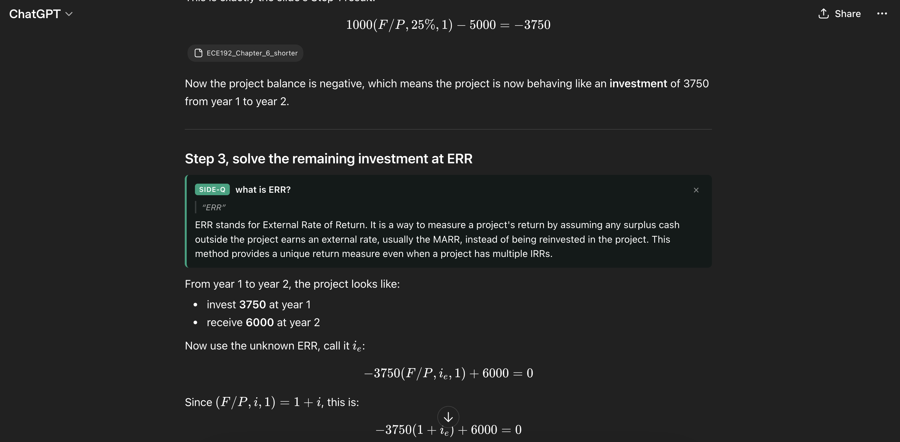

# ChatGPT Side-Question

Video:
[Demo](https://www.loom.com/share/1a1cb3db3fe64cf8bf2b3bfee0102100)



A cross-browser WebExtension (Chrome + Firefox, MV3) that adds a "highlight → ask a side-question" affordance to ChatGPT.

Select any text inside an assistant message, click the **Ask side-question** pill, type a short follow-up, and get a concise answer rendered **inline right under the paragraph you highlighted** — answered by a separate OpenAI call using your own API key. The main ChatGPT thread is not touched, so no context pollution and no scrolling to the bottom of the page just to read a one-sentence answer.

## Setup

1. Clone / download this repo.
2. Grab an OpenAI API key from <https://platform.openai.com/api-keys>.

> **Easy mode:** once the extension is loaded, you can skip the options page entirely. Just highlight text in a ChatGPT reply, click **Ask side-question**, type anything, and press Enter. If no key is stored yet, the answer card turns into a mini setup form right there — paste your key, pick a model, click **Save & ask**, and the question you just typed fires automatically. The dedicated options page below is still available for changing the key or model later.

### Chrome / Chromium / Edge / Brave

1. Open `chrome://extensions`.
2. Toggle **Developer mode** (top right).
3. Click **Load unpacked** and select this project folder.
4. Either use easy mode above, or open the extension's options page (click the puzzle-piece icon → ChatGPT Side-Question → Options) to paste a key, pick a model, click **Test key**, then **Save**.

### Firefox

1. Open `about:debugging#/runtime/this-firefox`.
2. Click **Load Temporary Add-on…** and pick `manifest.json` in this folder.
3. In `about:addons` open the extension's **Permissions** tab and grant access to `api.openai.com` (Firefox MV3 requires this to be granted explicitly).
4. Either use easy mode above, or open the extension's **Preferences** (⚙ → Options) to paste a key, pick a model, click **Test key**, then **Save**.

Temporary add-ons in Firefox are cleared on browser restart. For a persistent install, package the extension with `web-ext` and use a signed build.

## Using it

1. Go to <https://chatgpt.com> and start a conversation.
2. When ChatGPT replies, **highlight any text** in the reply (at least two characters).
3. A small green **Ask side-question** pill appears near the selection.
4. Click it, type your follow-up (e.g. _"what does this mean?"_, _"give me an example"_), press Enter.
5. A card is inserted **directly under the paragraph / list / code block you highlighted** — not at the bottom of the message — with a streaming answer.

If no API key is stored yet, the card shows an inline setup form instead; paste your key, pick a model, hit **Save & ask**, and it retries automatically.

Selections spanning multiple messages, or selections inside your own messages, don't trigger the pill — by design.

## What gets sent to OpenAI

Per side-question the extension posts:

- A system prompt asking for concise (≤3 sentence) plain-text answers.
- The **full text of the assistant message** your selection came from (as context).
- The **highlighted snippet**.
- Your **question**.

Nothing is sent to OpenAI outside of that single request, and the API key is stored only in `browser.storage.local` on your device.

## Icons

Placeholder — the manifest does not reference any icon files. Drop PNGs in `icons/` and add the usual `icons` / `action.default_icon` blocks to `manifest.json` when you want them.

## Troubleshooting

- **Pill never appears** — ChatGPT may have renamed the message selectors. Edit `SELECTORS` at the top of `src/content/content.js`.
- **Card asks for an API key** — paste one into the inline form and click **Save & ask**. (This also shows up on Firefox temporary add-ons after every reload, since FF wipes extension storage on reload.)
- **Card shows `OpenAI 401`** — key is invalid or expired. Open the options page and update it.
- **Card shows `OpenAI 429`** — rate-limited; wait a moment or switch models.
- **Firefox: fetch fails silently** — check `about:addons` → extension → **Permissions** → that `api.openai.com` access is granted.

## Layout

```
manifest.json
src/
  background/background.js   # OpenAI streaming caller (service worker / event page)
  content/content.js         # selection detector, pill, composer, inline card
  content/content.css
  options/options.{html,js,css}
```

---

Made with love by Pasha Khoshkebari
